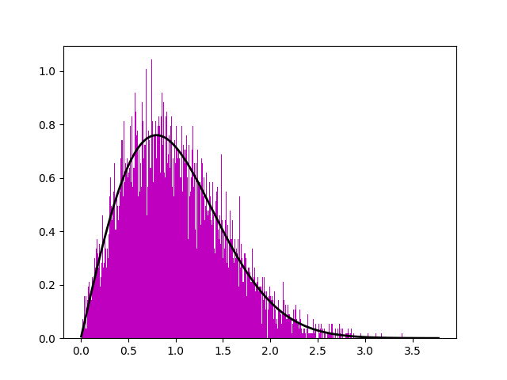

# Simple-GOE
A solution for one of Sethna's "Statistical Mechanics: Entropy, Order Parameters, and Complexity" problems.

Briefly, it's a program that creates a Gaussian Orthogonal Ensemble whose matrices' entries are independent gaussian random variables, and plots the approximate probability distribution of the differences of central eigenvalues divided by their average value along with the Wigner surmise. Here is an example for an ensemble made of 15000  4x4 matrices:

Constructive criticism for the code is welcome, especially because I am not used to programming.
